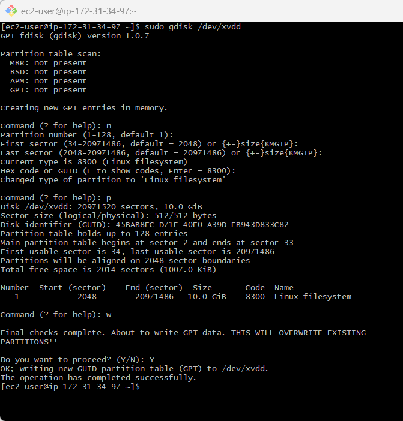
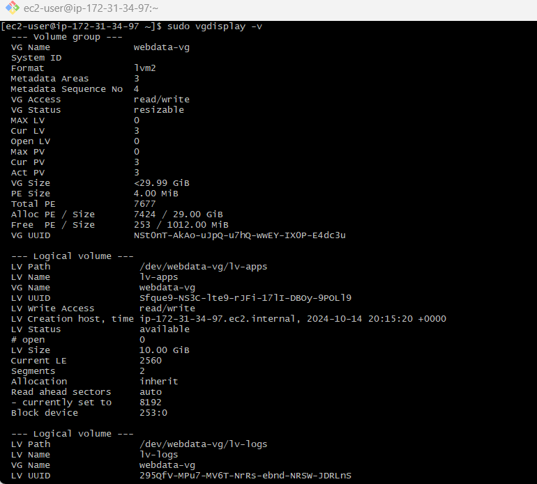

# DevOps Tooling Website Solution

This documentation outlines the step-by-step process of setting up a network file system (NFS) server on Red Hat Enterprise Linux 9, configuring MySQL on an Ubuntu server, and deploying a tooling website across multiple web servers. The goal is to ensure a scalable, fault-tolerant infrastructure that maintains data consistency across web servers using shared storage, while keeping the system stateless.

This project involved setting up logical volumes on the NFS server, configuring Apache and PHP, and deploying a website that connects to a MySQL database. The setup was done using AWS EC2 instances and aimed to ensure seamless functionality and shared storage solutions.

### In this project, we will implement a solution that consists of the following components:

1. Infrastructure: AWS
2. Webserver Linux: Red Hat Enterprise Linux 9
3. Database Server: Ubuntu 24.04 + MySQL
4. Storage Server: Red Hat Enterprise Linux 9 + NFS Server
5. Programming Language: PHP
6. GitHub Code Repository.

### Prerequisites

1. Knowledge of AWS core services and CLI
2. Basic knowledge of Linux commands and how to manage storage on a Linux server.
3. Basic knowledge of Network-attached storage (NAS), Storage Area Networks (SAN), and related protocols like NFS, FPT, SFTP, SMB, iSCSI.
4. Knowledge of Block-level storage and how it is used on the Cloud.
#### ARCHTECTURAL DESIGN


# DevOps Tooling Website Solution

This documentation outlines the step-by-step process of setting up a network file system (NFS) server on Red Hat Enterprise Linux 9, configuring MySQL on an Ubuntu server, and deploying a tooling website across multiple web servers. The goal is to ensure a scalable, fault-tolerant infrastructure that maintains data consistency across web servers using shared storage, while keeping the system stateless.

This project involved setting up logical volumes on the NFS server, configuring Apache and PHP, and deploying a website that connects to a MySQL database. The setup was done using AWS EC2 instances and aimed to ensure seamless functionality and shared storage solutions.


## STEPS INVOLVED

- [Step 1: Prepare NFS Server](#step-1-prepare-nfs-server)
- [Step 2: Configure Database Server](#step-2-configure-database-server)
- [Step 3: Prepare the Web Servers](#step-3-prepare-the-web-servers)


## Step 1: Prepare NFS Server
Spin up a new EC2 instance with RHEL Linux Operating System.
   
**Log to aws account console and create EC2 instance of t2.micro type with RedHat Server launch in the default region us-east-1. name instance _Linux NFS server_**


- SSH into the server:
  


Configure LVM on the server.
- Create and Attach 3 volumes of 10 GB each to the NFS server:
       

Inspect Block Devices
- Use the command  below to list all block devices connected to the server:
```bash
lsblk
```


- Check for the newly attached volumes. As seen above, it is /dev/xvdd, /dev/xvde, and /dev/xvdf.
- Run the following command to view all mounted filesystems and their free space:
```bash
df -h
```
  
  
Partition the disk
  - Use gdisk to create a partition on each of the disks, run
  `sudo gdisk /dev/xvdd`:

  1. Press `n` to create a new partition:
  2. First sector: The system will suggest a starting sector for the partition. Press `Enter` to accept the default.
  3. Last sector: By default, it will fill the partition with all available space (10 GiB in your case). Press Enter to accept the default.
  4. Partition type code: You’ll need to specify a partition type. Since you're using LVM, type `8E00 `for "Linux LVM". If not using LVM, you can leave it as default by pressing `Enter`.
  5. Writing the Partition Table to Disk, Once you’ve created the partition, you need to write the changes to the disk. To do this:
    - Press `w` to write the changes.
    - Confirm the action by typing yes when asked to proceed.

  At this point, the partition has been created, and gdisk will exit:
  
      
Repeat the above process for the Other Disks:
```bash
sudo gdisk /dev/xvdg
```
     
```bash
sudo gdisk /dev/xvdh
```
     
View the Partitions
```bash
lsblk
```


Create logical volumes `lv-opt` `lv-apps`, and `lv-logs`.
**Install lvm2 package**
```
sudo yum install lvm2
```


**Check for available partitions.**
```
sudo lvmdiskscan 
```


**Create Physical Volumes Use pvcreate utility to mark each of 3 disks as physical volumes (PVs) to be used by LVM**
```
sudo pvcreate /dev/xvdd1 /dev/xvde1 /dev/xvdf1
```


**Verify that your Physical volume has been created successfully**
```
sudo pvs
```
[image](images/ssh8.png)

**Use `vgcreate` utility to add all 3 PVs to a volume group (VG) Name the VG `webdata-vg`**
```
sudo vgcreate webdata-vg /dev/xvdd1 /dev/xvde1 /dev/xvdf1
```


**Verify that your VG has been created successfully**
```
sudo vgs
```


**Create Logical Volumes Use `lvcreate utility` to create logical volumes

```
sudo lvcreate -L 14G -n lv-apps webdata-vg
sudo lvcreate -L 14G -n lv-logs webdata-vg
sudo lvcreate -L 14G -n lv-opt  webdata-vg
```


there is no enough space to create `lv-opt` and we have to make free some spaces


**Verify that our Logical Volume has been created successfully**
``` 
sudo lvs
```


**Verify the entire setup #view complete setup - VG , PV, and LV**
```
sudo vgdisplay -v
```


3. Instead of formatting the disks as `ext4` you will have to format them as `xfs`
- Ensure there are 3 Logical Volumes `lv-opt` `lv-apps`, and `lv-logs`
```
sudo lsblk
```


**Format the Logical Volumes as `XFS`:**
```
sudo mkfs.xfs /dev/webdata-vg/lv-apps
sudo mkfs.xfs /dev/webdata-vg/lv-logs
sudo mkfs.xfs /dev/webdata-vg/lv-opt
```


- Create mount points on `/mnt` directory for the logical volumes as follows: `Mount lv-apps` on `/mnt/apps` - To be used by webservers ,`Mount lv-logs` on `/mnt/logs` - To be used by webserver logs, `Mount lv-opt` on `/mnt/opt` - To be used by Jenkins server in Project 8

**Create Directories**:
```
sudo mkdir /mnt/apps
sudo mkdir /mnt/logs
sudo mkdir /mnt/opt
```
```
cd /mnt
ls
```


**Mount Logical Volumes**

```
sudo mount /dev/webdata-vg/lv-apps /mnt/apps
sudo mount /dev/webdata-vg/lv-logs /mnt/logs
sudo mount /dev/webdata-vg/lv-opt /mnt/opt
```


4. Install NFS server, configure it to start on reboot and make sure it is up and running

**Update the System and Install NFS Utilities**:
```
sudo yum -y update
```


```
sudo yum install nfs-utils -y
```


**Start and Enable NFS Server**:

```
sudo systemctl start nfs-server.service
```
```
sudo systemctl enable nfs-server.service
```
```
sudo systemctl status nfs-server.service
```


5. Export the NFS Mounts'

> Use `subnet cidr` to connect as clients. For simplicity, we will install our all three Web Servers inside the same subnet, but in _production_ set up  would probably want to separate each tier inside its own subnet for higher level of security. To check our subnet cidr - open our EC2 details in AWS web console and locate `Networking` tab and open a Subnet link:

**Set Permissions on Mount Points**
```
sudo chown -R nobody:nobody /mnt/apps
sudo chown -R nobody:nobody /mnt/logs
sudo chown -R nobody:nobody /mnt/opt
sudo chmod -R 777 /mnt/apps
sudo chmod -R 777 /mnt/logs
sudo chmod -R 777 /mnt/opt
```


**Restart NFS Server**

```
sudo systemctl restart nfs-server.service
```


Configure access to NFS for clients within the same subnet (example of Subnet CIDR - 172.31.32.0/20 ):


```
sudo vim /etc/exports
```

**Add the following lines**:
```
/mnt/apps 172.31.32.0/20(rw,sync,no_all_squash,no_root_squash)
/mnt/logs 172.31.32.0/20(rw,sync,no_all_squash,no_root_squash)
/mnt/opt 172.31.32.0/20(rw,sync,no_all_squash,no_root_squash)
```


**save and exit from the editor by** `Esc + :wq!`

**Export the NFS Shares**:

```
sudo exportfs -arv
```


7. Check which port is used by NFS and open necessary ports in Security Groups (add new Inbound Rule)

**Check NFS Ports**:

```
rpcinfo -p | grep nfs
```


> **Important note**: In order for NFS server to be accessible from our client,we open following ports:
- `TCP 111`
- `UDP 111`
- `UDP 2049`
- `UDP 2049`
  


## Step 2 - Configure the database server

launch an Ec2 instance with neccessary configurations


ssh into the instance


Install MySQL server

```
sudo apt install mysql-server
```

Run mysql secure script

```
sudo mysql_secure_installation
```

